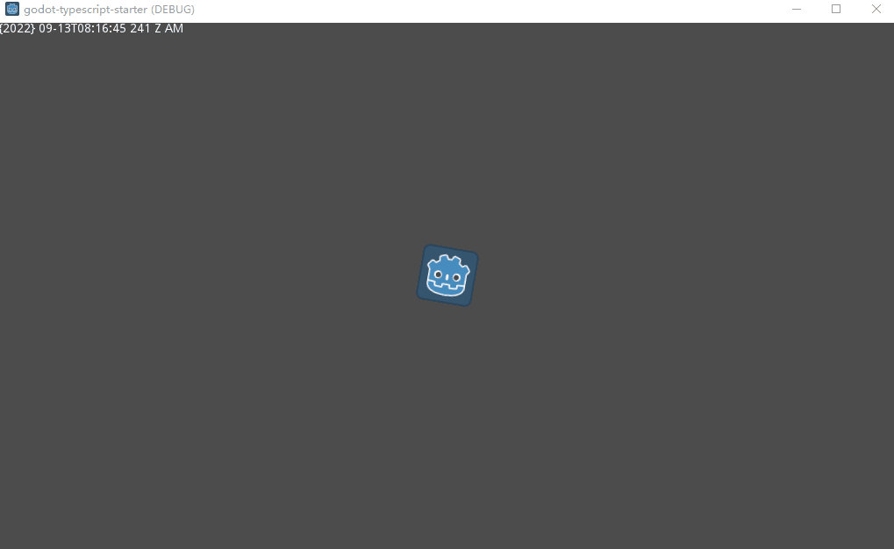

# Godot typescript start template

  </img>

## Features

* 🦾 TypeScript, of course [`JsBinding` for godot](https://github.com/Geequlim/ECMAScript)
* 🔥 Use the [new `3.5.stable` version](https://godotengine.org/download)
* ⚡️ [ESBuild](https://github.com/evanw/esbuild) fastify to build,support use npm packages
* 🌍 [Web API support for godot](https://github.com/Geequlim/WebAPI)
  + WindowOrWorkerGlobalScope
     - websocket
     - setTimeout
     - clearTimeout
     - setInterval
     - clearInterval
     - btoa
     - atob
     - performance
     - localStorage
     - sessionStorage

  + Performance API
  + Storage API
  + Event
  + EventTarget
  + XMLHttpRequest

## Usage

  + `cd source` && `pnpm i` *npm or yarn* 
  + `npm run dev` Happy coding with typescript!

* When I created this template, I used the 16+ version, maybe more than 13+ (type:module)

## Download

 - Go to the actions to download compiled editor and template 
  + [windows](https://github.com/citizenll/ECMAScript/actions/runs/3030483096)
  + [macos](https://github.com/citizenll/ECMAScript/actions/runs/3030483092)
